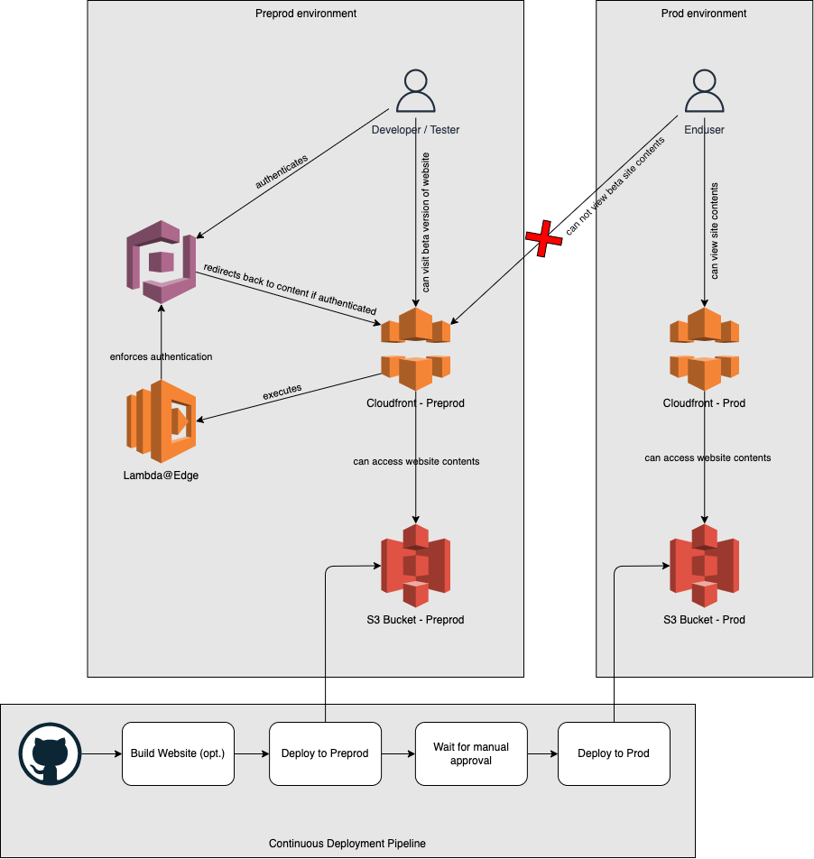

# betablocker

> Disclaimer: This is not a finished project yet

- [betablocker](#betablocker)
  - [What is it?](#what-is-it)
  - [Lets draw some pictures](#lets-draw-some-pictures)
  - [Repo Contents](#repo-contents)
    - [AWS CDK for setting up & configuring AWS resources](#aws-cdk-for-setting-up--configuring-aws-resources)
    - [A sample project which we want to deploy](#a-sample-project-which-we-want-to-deploy)
    - [A deployment pipeline based on Github action](#a-deployment-pipeline-based-on-github-action)

## What is it?

A pre-production deployment of a static website (can also be considered as `beta` version) on AWS S3, distributed by AWS Cloudfront and secured by a Lambda@Edge function enforcing authentication against AWS Cognito (to `block` unwanted visitors to see what you are currently working on). Therefore the name `betablocker`. lol

## Lets draw some pictures

That one is not particularly accurate and well modeled, but you'll get what I want to achieve.


## Repo Contents

### AWS CDK for setting up & configuring AWS resources
The infrastructure as code to create and configure the necessary AWS resources, resides inside the `cdk` folder. 

Create the resources by running:
```bash
cdk deploy
```

> Note, that after running the command, you will get the Cloudfront distribution ids for both environments. Note them down, you will need them when configuring your pipeline.


And tear them down using:
```bash
cdk destroy
```


### A sample project which we want to deploy

Thats not more than a basic "Hello World" site inside the folder `website`. Its just for testing & demonstration purposes.


### A deployment pipeline based on Github action 

You can find it inside the `.github` folder.

For the manual approval to work, you need to have a public Github repo or use Github Enterprise. If that is not viable, dont make use of the approval mechanisms and separate the deployment pipelines. You will find a solution.

You need to provide these Github action secrets, for the pipeline to work:

- AWS_ACCESS_KEY_ID
- AWS_SECRET_ACCESS_KEY
- S3_BUCKET_REGION
- S3_BUCKET_PREPROD
- CLOUDFRONT_DISTRIBUTION_ID_PREPROD
- S3_BUCKET_PROD
- CLOUDFRONT_DISTRIBUTION_ID_PROD
